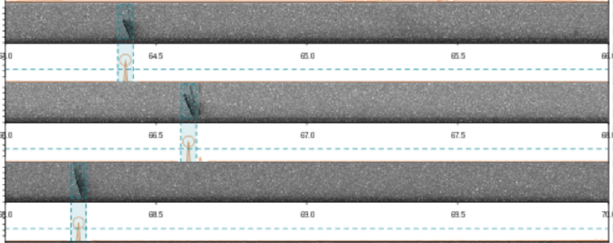

# Flight coordination in *Thyroptera*

> analyzing vocal behavior during group flight in Spix's disc-winged bats (Thyroptera tricolor)

## Table of contents
* [General info](#general-info)
* [Analyses](#Analyses)
* [To do list](#to-do-list)
* [Contact](#contact)

## General info

Code used for detecting inquiry calls produced during flight tests and analyzing dynamics of calling activity in solo and group flights

## Analysis

* [Automatic inquiry call detection](https://rpubs.com/marcelo-araya-salas/671954)
* [Building predictive models to identify calling individuals based on acoustic structure]()
    - 50 random forest with data subsets of same size for all individuals within a group
    - Testing different acoustic parameters sets
    - Determine probability threshold that optimizes sensitivity and number of calls used (all in solo flights)

* [Applying predictive model to group flight calls](https://rpubs.com/marcelo-araya-salas/818063)
    - Apply random forests on group flights and average probabilities 

* [Calling activity](https://rpubs.com/marcelo-araya-salas/671951)
    - Calling rate along recordings 
* [ID individuals in group flights](hhttps://rpubs.com/marcelo-araya-salas/679920)

## In progress

* Call individuality within groups based on acoustic structure
* Indentifying individuals in group flight
* Calculate a class probability threshold across groups that maximizes sensitivity and keeps a good enough sample size
* Create several models by resampling group call data so all individuals have the same n and then "average" class probabilities across models 
* Measure signal structure

## To-do list

* Repeatibility of calling rate (**groups** and individuals)
* Carry uncertainty of call ID prediction
* Look at coordination in group flights (randomization test?)
* Test for association between time from start of experiment and calling rate (seems to be highly significant)
* Based on previous test test for association between calling rate and flight cohesiveness controling (or not) for time from start of experiment (forml^ <- "dist ~ call.rate + time from clap")
* Look for association between overall group cohesion and calling rate, controling for group size
* Check groups used for checking cohesion and calling rate (whether mixed groups were included)
* New graphs : baseline, stress response, and distance moved by week versus week 1, plus calls by week (split by treatment)

## Status
Project is: _in progress_

## Contact
Created by [Marcelo Araya-Salas](https://marceloarayasalas.weebly.com/)
